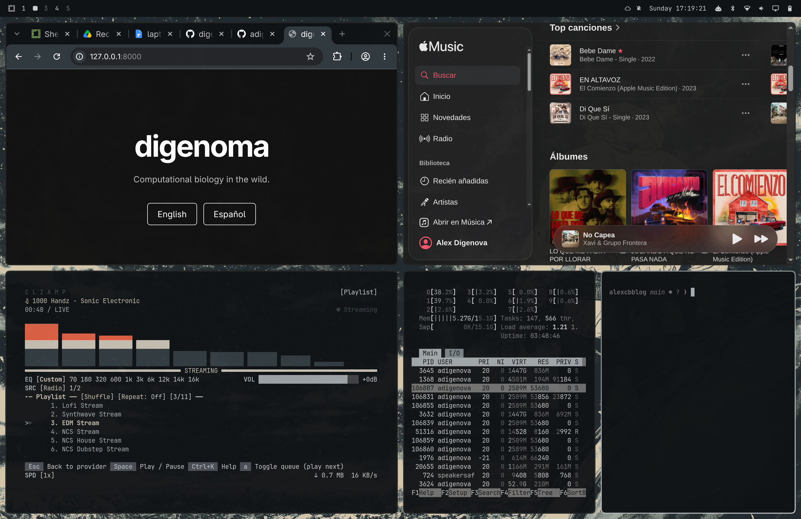

Durante mucho tiempo pensé que ya había terminado mi historia con Linux como sistema operativo de escritorio.

Empecé a usar Linux alrededor de 2003, cuando todavía era perfectamente normal instalar algo en un computador y pasar las siguientes horas intentando descubrir por qué no funcionaba el sonido, la tarjeta de video, el Wi-Fi o, en los días particularmente afortunados, ninguna de las anteriores.

Lo usé como sistema principal hasta aproximadamente 2010. Probé varias distribuciones, configuré escritorios, rompí configuraciones, las arreglé y aprendí buena parte de lo que sé de computadores precisamente porque Linux obligaba a entender un poco mejor qué estaba ocurriendo bajo el capó.

Incluso tuve mi época de **[Enlightenment](https://www.enlightenment.org/)**, tratando de construir ese escritorio Linux minimalista, bonito y futurista que uno imaginaba que debía existir.

Era bonito.

A veces.

Cuando funcionaba.

Luego llegó macOS.

Y durante unos 16 años prácticamente dejé de utilizar Linux como escritorio.

Pero Linux nunca desapareció realmente de mi vida.

Simplemente se mudó al clúster.

## Linux nunca se fue

Mientras mi computador personal pasó a ser un Mac, gran parte de mi trabajo científico siguió ocurriendo en Linux.

Kütral funciona sobre CentOS. Leftraru sobre Red Hat. Y prácticamente todos los servidores, clústeres y máquinas donde hago análisis bioinformáticos importantes ejecutan alguna variante de Linux.

Mi vida computacional terminó entonces dividida de una manera bastante natural:

**macOS en el notebook, Linux en el clúster.**

Durante muchos años esa combinación funcionó extraordinariamente bien.

Además, mientras esto ocurría, silenciosamente cambió otra cosa importante: **mis datos dejaron de vivir realmente en mi computador**.

El código se fue a [GitHub](https://github.com/).

Los documentos y archivos personales se fueron a Google Drive.

La música se fue a Apple Music.

Los repositorios científicos viven en servidores.

Los conjuntos de datos grandes están en clústeres.

Los análisis importantes se ejecutan remotamente.

Incluso buena parte del software comenzó a convertirse en servicios web.

Sin darme cuenta, el computador dejó de ser el lugar donde estaban mis cosas.

Se convirtió principalmente en **una interfaz para acceder a ellas**.

Y eso cambia bastante la pregunta de qué sistema operativo necesito.

## Algo empezó a sentirse extraño en macOS

No hubo un día específico en que decidiera:

> Se acabó. Me voy de macOS.

Fue algo bastante más gradual.

Mi MacBook Pro con M1 Pro sigue siendo un computador excelente. De hecho, ese será un problema al final de esta historia.

Pero últimamente macOS empezó a sentirse menos cómodo para mi forma de trabajar.

En parte eran pequeñas molestias operacionales. Google Chrome consumiendo cantidades absurdas de memoria. Pantallas congelándose. El sistema entrando ocasionalmente en esos estados donde uno piensa:

> Esto no debería estar pasando en un computador de este precio.

Pero había otra cosa más interesante.

## Llegaron los chatbots

Durante los últimos años cambió una pieza importante de mi flujo de trabajo: aparecieron [ChatGPT](https://chatgpt.com/), [Codex](https://openai.com/codex/) y los LLM en general.

Pasaron rápidamente de ser una curiosidad a convertirse en herramientas que uso con bastante frecuencia.

Para programar.

Para explorar ideas.

Para revisar código.

Para entender errores.

Para discutir análisis.

Para escribir.

Para buscar alternativas.

Para hacer esas preguntas pequeñas que antes significaban veinte minutos entre [Stack Overflow](https://stackoverflow.com/), documentación y algún issue abandonado de GitHub de 2017.

Y curiosamente empecé a sentir que el modelo tradicional de aplicaciones de macOS ya no encajaba tan naturalmente con esta nueva forma de trabajar.

Mi trabajo estaba cada vez más basado en:

**terminal + navegador + editor + chatbot + clúster.**

Y macOS empezó a sentirse como una capa adicional entre esas cosas.

Nada dramático.

Simplemente dejó de sentirse completamente natural.

Entonces apareció una idea peligrosa:

> ¿Y si vuelvo a Linux?

## Predicar con la práctica

Había además una razón que me empezó a molestar particularmente como profesor de computación.

En varias de mis cursos enseño Linux.

Terminal.

SSH.

Clusters.

Programación avanzada.

Herramientas científicas.

Y durante una clase reciente tuve una sensación un poco incómoda:

estaba enseñando a mis estudiantes que Linux era fundamental para la ciencia computacional...

...desde un Mac.

Por supuesto, técnicamente no hay ninguna contradicción.

Pero empezó a parecerme poco consistente.

Además, un Mac sigue siendo un computador caro. Si estoy enseñando herramientas que deberían permitir a un estudiante construir un excelente ambiente de trabajo utilizando software libre y hardware convencional, tenía sentido intentar vivir yo también dentro de ese ecosistema.

Algo así como **predicar con la práctica**.

Entonces hice lo que hacemos todos cuando queremos tomar una decisión tecnológica perfectamente racional.

Busqué qué estaba *hot*.

Miré tendencias en GitHub.

Y apareció:

**[Omarchy](https://omarchy.org/).**

## ¿Qué demonios es Omarchy?

Omarchy es un entorno Linux basado en [Arch Linux](https://archlinux.org/) y [Hyprland](https://wiki.hypr.land/) con una filosofía bastante clara: muchas cosas se manejan desde el teclado, las aplicaciones ocupan automáticamente el espacio disponible y el sistema intenta mantenerse visualmente limpio.

Mi primera reacción fue:

> Esto se ve sospechosamente bonito para ser Linux.

Durante años había aceptado tácitamente una especie de ley universal:

**Linux puede ser potente, pero no bonito, e intentar ambas cosas simultáneamente requiere abandonar varios fines de semana.**

Omarchy parecía estar intentando romper esa regla.

Además, había soporte para Apple Silicon gracias al enorme trabajo realizado alrededor de [Asahi Linux](https://asahilinux.org/).

Tenía un MacBook disponible.

Tenía espacio en el disco.

Tenía curiosidad.

Claramente era necesario hacer algo irresponsable =).

## El momento en que volvemos a sudar...

La instalación fue bastante sencilla.

Excepto por un pequeño detalle.

Había que cambiar el tamaño de la partición de macOS.

Mientras observaba avanzar el proceso de redimensionamiento, recordé inmediatamente mis años universitarios.

En particular, recordé aquellas ocasiones en que, experimentando con particiones de Linux, logré borrar sistemas operativos que no tenía ninguna intención de borrar.

Hay conocimientos que uno nunca olvida.

Y traumas tampoco.

La diferencia es que hoy casi todo lo importante está en la nube.

Mi código está en GitHub.

Mis documentos están sincronizados.

Los datos científicos están en servidores.

Las fotografías también están respaldadas.

Así que el riesgo real era mucho menor que hace veinte años.

Pero ver cómo una herramienta modifica las particiones del disco donde está toda tu vida digital sigue produciendo una cantidad saludable de adrenalina.

Terminé la instalación.

Reinicié.

Apareció el bootloader.

Seleccioné Linux.

Y funcionó.

Ese primer arranque produjo una mezcla interesante de satisfacción y:

> Bueno... parece que no borré macOS.

Éxito.

## Por primera vez encontré Linux realmente bonito

Esta fue probablemente mi primera gran sorpresa.

Omarchy es **hermoso**.

No hermoso “considerando que es Linux”.

Hermoso.

Punto.

La tipografía.

Los espacios.

Las terminales.

Las animaciones.

La consistencia visual.

El modo oscuro.

La forma en que aparecen las ventanas.

Todo tiene una estética coherente.

Y para alguien que había intentado hacer algo parecido con Enlightenment años atrás, fue bastante impresionante que todo eso simplemente estuviera ahí.

Pero lo realmente interesante no fue la apariencia.

Fue el sistema de ventanas.

## ¿De dónde salió Hyprland?


Durante los primeros minutos uno tiene que olvidar ciertas costumbres.

En macOS había desarrollado años de memoria muscular:

`Command + Tab`.

Mission Control.

Ventanas flotando unas encima de otras.

Arrastrarlas.

Redimensionarlas.

Buscar dónde quedó determinada aplicación.

Omarchy utiliza Hyprland y un modelo de ventanas en mosaico.

> En los 2000 intenté construir este escritorio con Enlightenment; veinte años después descubrí que Hyprland era lo que estaba buscando.

Abres algo.

El sistema encuentra dónde ponerlo.

Abres otra cosa.

El espacio se reorganiza.

Cambias de workspace con el teclado.

Mueves una ventana a otro workspace con el teclado.

Cierras una aplicación con el teclado.

Prácticamente todo ocurre sin tocar el mouse.

Y descubrí algo inesperado:

**para mí esto se siente mucho más natural que el escritorio tradicional.**


No sé por qué tardé tanto en probar seriamente un *tiling window manager*.

Creo que la razón es más simple: durante años dejé de mirar Linux como una alternativa real de escritorio. Seguía usándolo todos los días en servidores y clústeres, pero en mi cabeza había quedado congelado en la imagen que tenía de él cuando migré a macOS.

Simplemente no había considerado que Linux pudiera evolucionar hacia un escritorio así: rápido, coherente, visualmente cuidado y pensado para manejar casi todo desde el teclado.

Hyprland fue, en ese sentido, una sorpresa. No porque introdujera una idea completamente nueva, sino porque me mostró cuánto había cambiado Linux mientras yo seguía usándolo, paradójicamente, todos los días... pero sólo del otro lado de una conexión SSH.

Desde el primer momento ya estaba haciendo algo como:

```text
Workspace 1 → código
Workspace 2 → terminales y clúster
Workspace 3 → navegador y papers
Workspace 4 → ChatGPT
Workspace 5 → otras cosas
```

y saltando entre ellos casi sin pensar.

Es rápido.

Muy rápido.

El computador deja de sentirse como una colección de ventanas y pasa a sentirse como espacios de trabajo.

Quizás sea entusiasmo de recién llegado, pero ha sido una de las cosas que más me ha impresionado.

## El pequeño problema de SUPER + W

Por supuesto, cambiar 16 años de memoria muscular tiene consecuencias.

En macOS:

`Command + W` cierra la pestaña o la ventana activa.

En Omarchy:

`SUPER + W` cierra la aplicación.

Durante los primeros días, cada vez que quería cerrar una pestaña en Chromium, mis dedos repetían el gesto aprendido durante años en macOS.

Y cerraban la aplicación completa.

No la pestaña.

La aplicación.

También había entendido mal otro atajo: pensaba que `SUPER + T` abriría una terminal. En Omarchy, en realidad, sirve para alternar el estado de la ventana.

Así que el problema no era estar llenando el escritorio de terminales nuevas.

Era bastante más eficiente: cerraba de golpe la aplicación en la que estaba trabajando.

Después de 16 años, la memoria muscular tarda un poco en aceptar que `Command` y `SUPER` no hablan exactamente el mismo idioma.

El cerebro todavía está migrando.

## El hardware... simplemente funciona

Esta quizás sea la parte que más contrasta con mis recuerdos de Linux.

Hace veinte años instalar Linux significaba frecuentemente comenzar una negociación diplomática con el hardware.

Tarjeta de video.

Drivers.

Wi-Fi.

Audio.

Suspensión.

Brillo.

Alguna cosa siempre decidía que no quería cooperar.

Y las GPUs merecían una categoría especial de sufrimiento.

Por eso me sorprendió particularmente comprobar cuánto ***ha cambiado todo***.

Omarchy reconoció prácticamente todo mi hardware.

Incluso la GPU.

Pude empezar rápidamente a probar **LLMs locales** utilizando aceleración gráfica.

Eso habría parecido ciencia ficción durante mi primera etapa usando Linux.

Un modelo de lenguaje corriendo localmente sobre la GPU de un Mac...

...en Arch Linux.

Y funcionando.

Hubo algunas pequeñas cosas que configurar, por supuesto.

La iluminación del teclado inicialmente no funcionaba como quería.

Las teclas de brillo necesitaron configuración.

La zona horaria decidió brevemente que Chile estaba en otro lugar del planeta.

Pero eran problemas pequeños y, más importante, **comprensibles**.

No semanas intentando compilar un driver encontrado en un foro ruso.

Linux ha cambiado mucho.

## Reconstruir mi computador fue sorprendentemente fácil

Entonces empezó un experimento que me pareció bastante revelador.

¿Qué necesito realmente para reconstruir mi vida digital?

GitHub.

Configurado.

Google Drive.

Accesible.

Apple Music.

Abierto en Chromium.

Funcionó inmediatamente.

Omarchy permite además instalar aplicaciones web como si fueran aplicaciones normales, así que Apple Music terminó instalado como una aplicación independiente.

Lo mismo con ChatGPT.

YouTube también.

Python y `uv`.

Listo.

Git.

GitHub CLI.

SSH.

Nextflow.

LaTeX.

Quarto.

Y acceso a los clústeres.

En muy poco tiempo tenía nuevamente casi todo mi ambiente de trabajo.

Esto habría sido mucho más traumático hace 16 años.

La nube cambió completamente lo que significa reinstalar un computador.

## Linux configurando Linux con ayuda de una IA

Una parte particularmente entretenida de esta experiencia es cómo he configurado Omarchy.

Instalo algo.

Hay un problema.

Le pregunto a ChatGPT.

Cambio una configuración.

Funciona.

Siguiente cosa.

En algún momento me di cuenta de la situación:

estaba utilizando ChatGPT dentro de Omarchy para aprender a configurar Omarchy mientras Omarchy ejecutaba herramientas de inteligencia artificial locales.

Es una especie de bootstrap informático de 2026.

Y también una demostración interesante de por qué quise hacer este cambio.

La combinación:

**Linux + terminal + LLM**

se siente extremadamente natural.

Un chatbot puede explicar una configuración.

Yo puedo abrir inmediatamente el archivo.

Modificarla.

Probarla.

Mostrar el error.

Corregirla.

Todo ocurre en un ciclo muy corto.

Los LLM reducen además una de las principales barreras históricas de Linux: el pequeño conocimiento específico que uno necesitaba para resolver cientos de problemas diferentes.

Antes:

> ¿Cómo hago esto?

Google.

Stack Overflow.

[ArchWiki](https://wiki.archlinux.org/).

Tres posts contradictorios.

Uno escrito en 2014.

Otro diciendo “solucionado” sin explicar cómo.

Ahora muchas veces puedo empezar simplemente preguntando.

Por supuesto que el modelo puede equivocarse.

Pero como interfaz para explorar el sistema es extraordinariamente útil.

Creo que los chatbots hacen a Linux **mucho más accesible de lo que era durante mi primera época usándolo**.

## Mis hijas tienen otra explicación

Mis hijas vieron el nuevo escritorio.

Terminales.

Ventanas moviéndose con el teclado.

Texto por todas partes.

Fondo oscuro.

Y rápidamente emitieron su diagnóstico:

> Papá, parece computador de hacker.

No discutí.

Después de veinte años trabajando en bioinformática y genómica, aparentemente por fin logré que mi computador cumpliera con la representación cinematográfica de mi profesión.

## ¿Entonces voy a borrar macOS?

No.

Por ahora.

Y esta es probablemente la parte menos romántica pero más razonable de la historia.

Todavía queda camino.

Hay cosas que necesito probar (conexión a pantallas, periféricos, proyectores, etc.).

Hay pequeños detalles del hardware que quiero evaluar (el sonido a veces tiene un chicharreo y no se siente de alta calidad).

Quiero saber cómo se comporta después de semanas y meses, no solamente durante la luna de miel de los primeros días.

Además existe otro problema importante:

**todavía no encuentro un notebook suficientemente bonito como para reemplazar mi MacBook.**

Apple fabrica hardware absurdamente bueno.

Mi problema nunca fue el computador.

Así que por ahora tengo ambos.

macOS sigue ahí.

Omarchy también.

Puedo arrancar cualquiera.

La diferencia es que durante estos primeros días no he tenido muchas ganas de volver a macOS.

## Después de Fedora, Debian, Ubuntu, Enlightenment y macOS...

He probado varios sistemas como para no declarar amor eterno a una distribución después de 48 horas.

Fedora.

Debian.

Ubuntu.

Distintos escritorios.

Enlightenment.

macOS durante más de una década.

Y siempre terminaba encontrando alguna combinación entre funcionalidad, estética y usabilidad que no terminaba de convencerme en Linux como escritorio.

Omarchy es la primera vez en mucho tiempo que siento algo diferente.

Arch entrega un ecosistema enorme.

El reconocimiento de hardware es incomparablemente mejor que el Linux que recuerdo.

Hyprland cambió completamente mi percepción de cómo debería funcionar un escritorio.

La integración con herramientas modernas es excelente.

Y, sorprendentemente importante:

**es bonito.**

Muy bonito.

La combinación de potencia, simplicidad, usabilidad y estética me tiene, por ahora, bastante entusiasmado.

Veremos cuánto dura.

>  A beautiful system is a motivating system, and motivation brings ideas to life, like this blog!

## Volver, pero a un Linux diferente

Lo curioso es que no siento realmente que haya vuelto al Linux que abandoné en 2010.

Ese sistema ya no existe.

El hardware cambió.

La nube cambió dónde viven nuestros datos.

GitHub cambió cómo manejamos código.

Los clústeres cambiaron cómo hacemos computación científica.

Los LLM están cambiando cómo programamos y cómo interactuamos con los computadores.

Y Linux también cambió.

Quizás por eso volver después de tantos años se siente sorprendentemente natural.

Mi computador personal ahora habla prácticamente el mismo idioma que los clústeres donde trabajo todos los días.

El teclado se convirtió nuevamente en la interfaz principal.

El sistema se aparta del camino.

Y cuando necesito entender algo, tengo probablemente la mejor documentación de Linux que ha existido...

más un chatbot dispuesto a acompañarme mientras inevitablemente rompo algo.

## Y de eso será este blog

Esta migración terminó además motivándome a hacer algo que llevaba tiempo pensando: empezar a escribir sobre las pequeñas aventuras que ocurren alrededor de mi trabajo.

No solamente papers terminados.

También las cosas que normalmente quedan fuera.

Una idea de análisis.

Un algoritmo.

Un problema extraño en genómica.

Un ensamblaje de genoma que decide no cooperar.

Un clúster.

Un paper interesante.

Un experimento con un LLM.

Una configuración de Linux.

Una buena figura.

O una idea que parecía brillante a las 11 de la noche y bastante menos brillante a la mañana siguiente.

Gran parte de la biología computacional ocurre precisamente ahí.

En esa mezcla entre ciencia, programación, computadores, experimentación y curiosidad.

Así que este blog comienza apropiadamente con una migración, un cambio, una acción.

Después de aproximadamente 16 años usando macOS como escritorio principal, volví a Linux.

Esta vez sobre un MacBook M1 Pro.

Con Omarchy.

El sistema de ventanas me tiene fascinado.

La GPU funciona.

Los LLM locales funcionan.

Apple Music funciona.

No borré accidentalmente el disco.

Y mis hijas creen que ahora soy hacker.

Por el momento, considero el experimento un éxito.

{fig-alt="Escritorio Omarchy en un MacBook con el sitio digenoma, Apple Music y varias terminales organizadas en mosaico" width="100%"}
